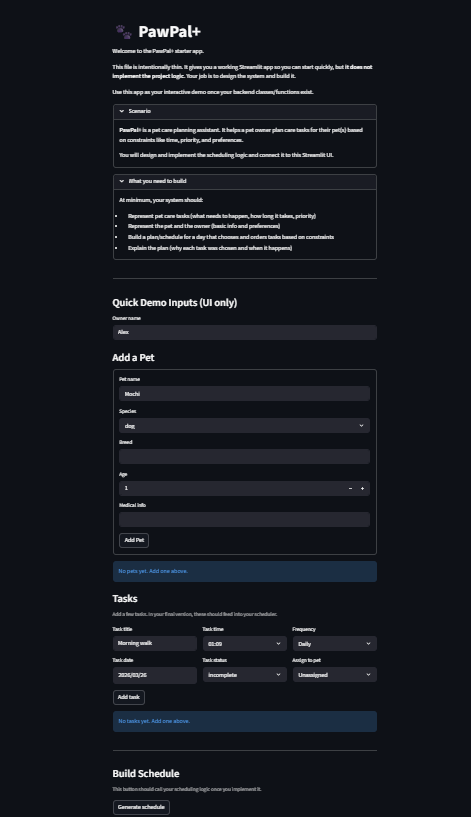

# PawPal+ (Module 2 Project)

You are building **PawPal+**, a Streamlit app that helps a pet owner plan care tasks for their pet.

## Scenario

A busy pet owner needs help staying consistent with pet care. They want an assistant that can:

- Track pet care tasks (walks, feeding, meds, enrichment, grooming, etc.)
- Consider constraints (time available, priority, owner preferences)
- Produce a daily plan and explain why it chose that plan

Your job is to design the system first (UML), then implement the logic in Python, then connect it to the Streamlit UI.

## What you will build

Your final app should:

- Let a user enter basic owner + pet info
- Let a user add/edit tasks (duration + priority at minimum)
- Generate a daily schedule/plan based on constraints and priorities
- Display the plan clearly (and ideally explain the reasoning)
- Include tests for the most important scheduling behaviors

## Getting started

### Setup

```bash
python -m venv .venv
source .venv/bin/activate  # Windows: .venv\Scripts\activate
pip install -r requirements.txt
```

### Suggested workflow

1. Read the scenario carefully and identify requirements and edge cases.
2. Draft a UML diagram (classes, attributes, methods, relationships).
3. Convert UML into Python class stubs (no logic yet).
4. Implement scheduling logic in small increments.
5. Add tests to verify key behaviors.
6. Connect your logic to the Streamlit UI in `app.py`.
7. Refine UML so it matches what you actually built.

## Features / Smarter Scheduling

- **Chronological Task Sorting:** Automatically orders care tasks by HH:MM time so owners can follow a clear daily timeline.
- **Schedule Conflict Detection:** Flags overlapping tasks that share the same date and time to prevent care-task collisions.
- **Task Status Filtering:** Filters tasks by status (`incomplete`, `complete`, `deleted`) so users can focus on what needs attention.
- **Pet-Specific Task Filtering:** Filters schedule items by pet name to support multi-pet households.
- **Recurring Task Continuation (Daily/Weekly):** When a recurring task is marked complete, the next occurrence is auto-created using date arithmetic.
- **Owner-Pet-Task Aggregation:** Supports owner-level planning by collecting tasks across all pets tied to one owner.
- **Clear UI Scheduling Feedback:** Uses Streamlit success and warning messages to communicate generated schedules and detected conflicts.

### Testing PawPal+

The current 7-test suite checks core logic paths including task completion state changes, pet task assignment, chronological sorting, daily recurrence creation on completion, duplicate time conflict detection, empty-scheduler behavior, and non-conflict handling for same times on different dates.

Command to run tests: python -m pytest

Confidence Level for system readability (based on 7/7 passing tests): ★★★★☆ (4/5)

Reason:

- Passing tests give strong confidence that key behaviors are clear and consistently implemented.
- The tests cover major happy paths and important edge cases.
- Readability is high, but not a full 5/5 because it is always possible to test more. As mentioned by Dijkstra, tests only prove presence of bugs, not their absence.

### 📸 Demo

[](pawpal.png)