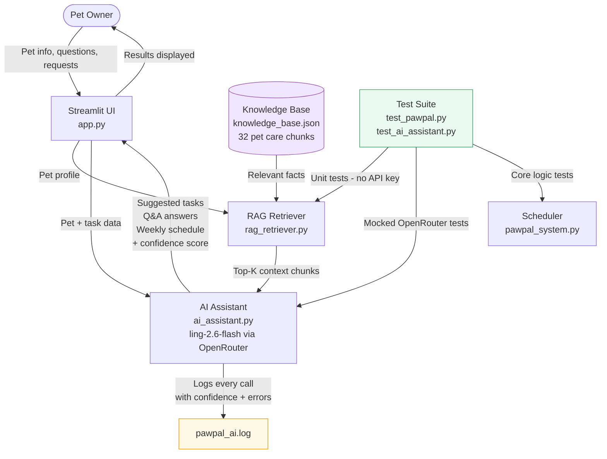

# PawPal+ AI Assistant

## Original Project

**PawPal+** (Module 2) was a Python/Streamlit pet care scheduling application that let a busy pet owner manage daily care tasks for one or more pets. It supported task creation with time, frequency, and pet assignment, chronological schedule generation, conflict detection, recurring task automation, and filtering by status or pet name.

---

## Title and Summary

**PawPal+ AI Assistant** is an AI-enhanced pet care planning tool that combines the original scheduling system with a RAG-powered AI layer. Owners can get personalised care task suggestions for each pet, ask any pet care question and receive answers grounded in a curated knowledge base, and generate a full 7-day care schedule — all powered by `inclusionai/ling-2.6-flash` via OpenRouter. This project matters as it eases the burden and pain while smoothing out the journey of being a pet owner.

---

## Architecture Overview



**Component roles:**
- **Knowledge Base** — 32 curated chunks covering species, common breeds, age groups, feeding, exercise, grooming, vet care, enrichment, and weekly scheduling.
- **RAG Retriever** — keyword overlap scorer that matches query terms (expanded with pet species, breed, and age-group tags) to knowledge base chunks. No external embedding API needed.
- **AI Assistant** — wraps `inclusionai/ling-2.6-flash` via OpenRouter. Each function retrieves relevant chunks first, then builds a structured prompt and requests JSON output with a confidence score.
- **Streamlit UI** — three AI sections: task suggestions (with one-click add), pet care Q&A, and weekly schedule generation.
- **Logging** — every AI call is logged to `pawpal_ai.log` with timestamp, pet info, chunk count, and confidence score.
- **Test Suite** — 7 original core tests + 10 new AI-layer tests (retriever tests need no API key; assistant tests mock OpenRouter).

**Data flow:** User input → RAG retrieval → OpenRouter prompt → JSON response → Streamlit display

---

## Setup Instructions

### 1. Clone the repository

```bash
git clone https://github.com/NourdotSiwar/oawpal-plus-applied-ai-system-project.git
cd oawpal-plus-applied-ai-system-project
```

### 2. Create and activate a virtual environment

```bash
python -m venv .venv
# Windows:
.venv\Scripts\activate
# Mac/Linux:
source .venv/bin/activate
```

### 3. Install dependencies

```bash
pip install -r requirements.txt
```

### 4. Set up your OpenRouter API key

Get a free API key at **openrouter.ai → Sign up → Keys**.

Create a `.env` file in the project root:

```
OPENROUTER_API_KEY=your_key_here
```

### 5. Run the app

```bash
streamlit run app.py
```

### 6. Run the tests

```bash
python -m pytest
```

---

## Sample Interactions

### Example 1 — AI Task Suggestions

**Input:** Owner adds a pet named "Bella" (dog, Golden Retriever, age 2), then clicks "Suggest tasks with AI".

**AI Output (confidence: 92%):**
- Morning walk — 07:30 (Daily)
- Breakfast feeding — 08:00 (Daily)
- Brushing session — 17:00 (Daily)
- Evening walk — 18:00 (Daily)
- Dental brushing — 20:00 (Daily)

**Reasoning:** Golden Retrievers are high-energy dogs needing regular exercise and daily coat brushing. At age 2 they are still developing good habits, so consistent dental care is introduced early.

---

### Example 2 — Pet Care Q&A

**Input:** "How often should I clean my cat's litter box?"

**AI Output (confidence: 89%):**
> Scoop the litter box at least once daily, ideally twice. Do a full litter replacement once per week. Cats are fastidious and will avoid a dirty litter box, which can lead to accidents and stress. Use an unscented clumping litter for most cats.

**Sources:** General cat care guidelines, cat daily routine knowledge base entry.

---

### Example 3 — AI Weekly Schedule

**Input:** Owner has two pets — "Max" (dog, Husky, age 4) and "Luna" (cat, Siamese, age 3). Clicks "Generate AI Weekly Schedule".

**AI Output (confidence: 87%):**

Monday–Sunday each includes:
- Max: Morning run 07:00, Breakfast 08:00, Training session 17:00, Evening walk 19:00, Dinner 18:00
- Luna: Breakfast 08:00, Playtime 10:00, Dinner 18:00, Evening play 20:00

**Reasoning:** Huskies require intense daily exercise so two walks plus a training session are scheduled. Siamese cats need regular interactive play to prevent boredom. Tasks are staggered so the owner can give each pet individual attention.

---

## Demo Walkthrough

[Watch the video walkthrough on Loom](https://www.loom.com/share/dc068eaa123d4f699e363ea1a1b351a2)

The video demonstrates an end-to-end system run including AI task suggestions, pet care Q&A, and weekly schedule generation with confidence scores.

---

## Further Documentation

See [model_card.md](model_card.md) for design decisions, testing results, limitations, ethical considerations, and AI collaboration reflections.

### Portfolio Artifact

[Link to Repository](https://github.com/NourdotSiwar/oawpal-plus-applied-ai-system-project)

After doing this project with the assistance of Claude, I have found that our entire lives are being influenced largely by how AI works and functions. While I believe software engineers will not be replaced AI, I strongly find that AI will be extremely helpful with making us much more productive on the job. Instead of figuring out the syntax for a new language or understanding documentation, future engineers will focus more on business impact and design decisions.

---
