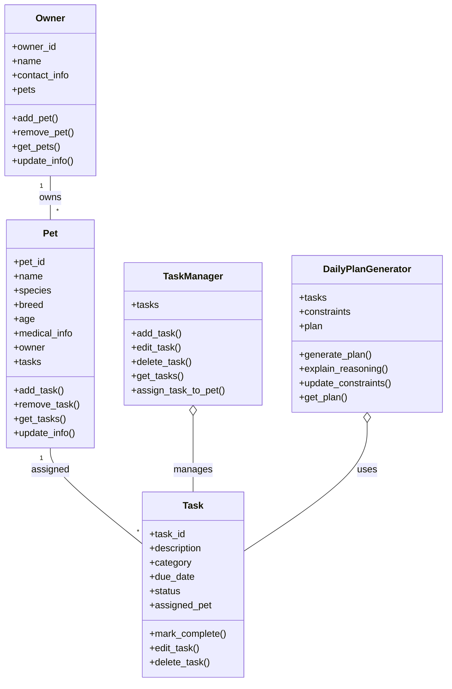

# Pet Care App Class Diagram (Mermaid.js)

This diagram represents the main classes and their relationships for the pet care app system design. Copy and paste the Mermaid code above into a Mermaid.js renderer or markdown viewer that supports Mermaid diagrams to visualize it.